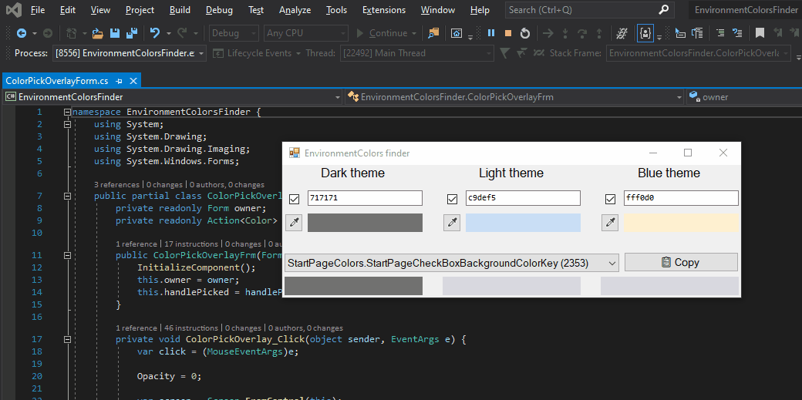

# EnvironmentColors finder

Updated version of the [EnvironmentColors finder](http://niahtextfilter.com/environmentcolorsfinder) ([source code](https://bitbucket.org/grantdavies/vsenvironmentcolorsfinder/src/master)) created by [Grant Davies](https://twitter.com/GrantTheAnt).

# Added features

* Pick a color directly from the screen, so you don't have to do the "take screenshot, open screenshot in Paint, pick color, copy & paste color value" routine anymore.
* Includes all color enumerations from `Microsoft.VisualStudio.PlatformUI` (Microsoft.VistualStudio.Shell.15.0), not just `EnvironmentColors`.
* [Dummy VS extension](./ColorDatabaseGenerator/README.md) to generate the color database.
* Resizable layout, because the property names can get really long.
